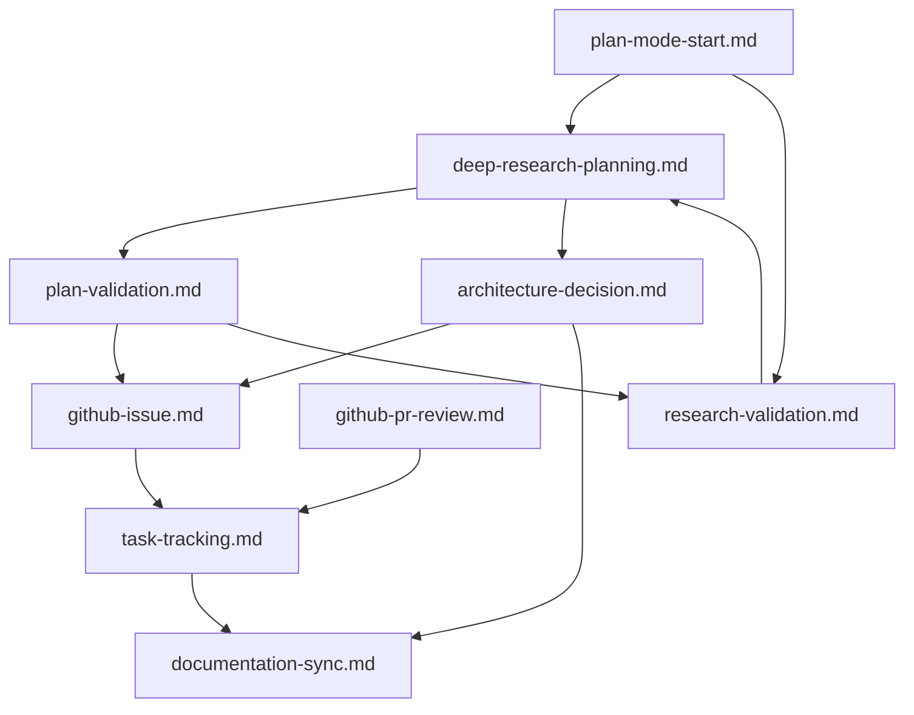

# Catálogo de Flujos de Trabajo

Este archivo documenta los flujos de trabajo disponibles y sus patrones de uso. Los flujos proporcionan procesos determinísticos paso a paso para tareas comunes.

## Flujos de Trabajo Disponibles

### Operaciones GitHub

#### `.clinerules/workflows/github-issue.md` - Gestión Mejorada de Issues
**Propósito**: Crear y gestionar issues de GitHub usando configuración centralizada
**Usar Cuando**: 
- Documentar solicitudes de características o errores
- Crear propuestas arquitectónicas
- Rastrear tareas de implementación

**Características Clave**:
- Usa herramientas MCP GitHub para consistencia
- Configuración centralizada desde `.clinerules/repo-config.json`
- Selección interactiva de hitos desde lista local
- Creación de issues basada en plantillas usando plantillas GitHub
- Asociación automática de proyecto (ID: 2)
- Mapeo de tipos de issue (feat/fix/chore/rfc)

#### `.clinerules/workflows/github-pr-review.md` - Revisión de Pull Request
**Propósito**: Proceso comprensivo de revisión de PR
**Usar Cuando**: 
- Revisar cambios de código
- Proporcionar retroalimentación estructurada
- Aprobar o solicitar cambios

**Características Clave**:
- Examina detalles de PR y archivos cambiados
- Revisa contexto y código circundante
- Proceso estructurado de confirmación de usuario
- Soporta aprobación, solicitudes de cambio y comentarios

#### `.clinerules/workflows/architecture-decision.md` - Creación Mejorada de ADR
**Propósito**: Documentar decisiones arquitectónicas con flujo de subissue RFC
**Usar Cuando**: 
- Tomar decisiones técnicas importantes
- Evaluar múltiples opciones de implementación
- Registrar justificación de diseño para referencia futura

**Características Clave**:
- Creación de issues estilo RFC usando configuración centralizada
- Documentación estructurada de decisiones con asignación de hitos
- Flujo de subissue RFC para desglose de implementación
- Enlace automático de subissues a RFC padre
- Integración con decisiones históricas
- Asociación y seguimiento de proyecto

#### `.clinerules/workflows/task-tracking.md` - Integración Mejorada de Issues
**Propósito**: Enlazar issues de GitHub con documentación de proyecto usando configuración centralizada
**Usar Cuando**: 
- Iniciar nuevos flujos de trabajo
- Actualizar estado de proyecto
- Rastrear progreso a través de múltiples issues
- Gestionar flujos de subissue RFC

**Características Clave**:
- Seguimiento de issues basado en configuración
- Organización basada en hitos
- Seguimiento y gestión de subissues RFC
- Gestión de referencias cruzadas con formato apropiado
- Gestión de ciclo de vida de issues con actualizaciones de estado
- Integración con generación de mensajes de commit

### Gestión de Proyecto

#### `.clinerules/workflows/milestone-management.md` - Sincronización de Hitos
**Propósito**: Mantener sincronización de hitos entre GitHub y configuración local
**Usar Cuando**: 
- La información de hitos parece desactualizada
- Antes de campañas importantes de creación de issues
- Configurando nuevas fases de proyecto

**Características Clave**:
- Sincroniza hitos de GitHub con configuración local
- Selección interactiva de hitos para issues
- Mantiene IDs de hitos consistentemente
- Actualiza configuración local cuando es necesario

#### `.clinerules/workflows/commit-message.md` - Generación de Mensajes de Commit
**Propósito**: Generar mensajes de commit estandarizados con asociación de issues GitHub
**Usar Cuando**: 
- Commiteando cambios para issues rastreados
- Asegurando formato consistente de mensajes de commit
- Enlazando commits a issues GitHub

**Características Clave**:
- Analiza cambios staged para detección de scope
- Mapea tipos de issue a tipos de commit convencionales
- Genera formato apropiado de commit con referencias de issues
- Soporta breaking changes y commits multi-scope
- Ejecución opcional de commit

#### `.clinerules/workflows/project-context.md` - Guía Específica de Proyecto
**Propósito**: Proporcionar guía de comandos específica de proyecto y contexto
**Usar Cuando**: 
- Trabajando en diferentes contextos de workspace
- Instalando paquetes en ambiente de extensión Chrome
- Ejecutando comandos de desarrollo o despliegue
- Incierto sobre patrones específicos de proyecto

**Características Clave**:
- Guía de comandos de workspace de extensión Chrome
- Patrones específicos de desarrollo AWS serverless
- Sugerencias de comandos conscientes de contexto
- Guía de configuración de ambiente de desarrollo
- Procedimientos de build y despliegue

### Gestión de Procesos

#### `.clinerules/workflows/plan-mode-start.md` - Iniciación Obligatoria de Planificación
**Propósito**: Asegurar planificación arquitectónica consistente y evaluación apropiada para tareas sustanciales
**Usar Cuando**: 
- **OBLIGATORIO**: Inicio de cualquier tarea sustancial en Modo Planificación
- Antes de decisiones arquitectónicas
- Al evaluar enfoques de implementación
- Comenzar planificación de desarrollo de características

**Características Clave**:
- Fuerza revisión de documentación esencial en orden prescrito
- Aplica Marco de Evaluación de Modo Planificación consistentemente
- Crea issues de GitHub para seguimiento
- Se integra con flujo de validación de investigación
- Proceso estructurado de planificación no opcional

#### `.clinerules/workflows/task-completion.md` - Actualizaciones Obligatorias de Documentación
**Propósito**: Actualizaciones sistemáticas de documentación después de confirmación humana de trabajo completado
**Usar Cuando**: 
- **OBLIGATORIO**: Después de que humano confirma "esto está hecho y funcionando"
- Siguiendo implementación exitosa de características
- Después de que cambios arquitectónicos están completados y probados
- Cuando decisiones importantes han sido implementadas

**Características Clave**:
- Actualiza tareaActual.md con trabajo completado
- Actualiza decisionesHistoricas.md para decisiones importantes
- Actualiza resumenCodigoFuente.md para cambios estructurales
- Referencias cruzadas de issues GitHub con estado de finalización
- Dispara documentation-sync cuando es necesario
- Captura sistemática de conocimiento no opcional

#### `.clinerules/workflows/research-validation.md` - Investigación Externa y Validación
**Propósito**: Investigación extendida usando Perplexity para validar enfoques arquitectónicos y reunir insights externos
**Usar Cuando**: 
- Evaluando decisiones arquitectónicas complejas
- Comparando enfoques de implementación o frameworks
- Investigando estándares de industria para patrones específicos
- Cuando conocimiento interno necesita validación externa
- Evaluación de tecnología e investigación de mejores prácticas

**Características Clave**:
- Plantillas estructuradas de preguntas de investigación
- Integración de herramienta MCP Perplexity para investigación dirigida
- Marco de análisis de resultados de investigación
- Integración con Marco de Evaluación de Modo Planificación
- Plantillas de resumen de investigación para documentación
- Escenarios de ejemplo para casos de uso comunes

#### `.clinerules/workflows/deep-research-planning.md` - Investigación Comprensiva y Planificación
**Propósito**: Combina análisis de codebase, investigación externa y pensamiento secuencial para crear planes de implementación precisos
**Usar Cuando**: 
- Tareas de implementación complejas que requieren integración con codebase existente
- Integración de arquitectura cuando nuevos componentes deben alinearse con patrones existentes
- Selección de tecnología con restricciones de codebase
- Planes de refactorización que requieren entendimiento de patrones actuales

**Características Clave**:
- Análisis sistemático de codebase con identificación precisa de archivos y funciones
- Investigación externa usando Perplexity para mejores prácticas de industria
- Síntesis de pensamiento secuencial para planes comprensivos de implementación
- Salida estructurada con rutas exactas de archivos, cambios de código y pasos de validación
- Verificación de puntos de integración y evaluación de riesgos
- Entregables precisos con resultados medibles

#### `.clinerules/workflows/plan-validation.md` - Validación Sistemática de Plan
**Propósito**: Análisis crítico de planes de implementación usando pensamiento secuencial para identificar brechas y verificar factibilidad
**Usar Cuando**: 
- Antes de implementar planes creados por deep-research-planning u otros procesos
- Revisión de plan cuando planes existentes necesitan evaluación crítica
- Evaluación de riesgo para planes de implementación
- Validación de arquitectura para decisiones significativas

**Características Clave**:
- Validación sistemática usando análisis de pensamiento secuencial
- Verificación de existencia de archivos y puntos de integración
- Evaluación de factibilidad técnica, alineación de arquitectura y completitud
- Reportes estructurados de validación con decisiones PASS/FAIL/NEEDS_REVISION
- Items de acción ordenados por prioridad con pasos específicos de remediación
- Evaluación basada en evidencia con referencias exactas de archivo/línea

### Gestión de Documentación

#### `.clinerules/workflows/documentation-sync.md` - Actualizaciones de Documentación
**Propósito**: Mantener documentación consistente y actual
**Usar Cuando**: 
- Completando tareas importantes
- Ocurren cambios arquitectónicos
- Referencias cruzadas necesitan validación

**Características Clave**:
- Revisa todos los archivos cline_docs
- Valida referencias cruzadas y enlaces
- Crea PRs de documentación cuando es necesario
- Asegura consistencia a través de archivos

## Invocación de Flujos de Trabajo

### Uso Básico
```
.clinerules/workflows/nombre-workflow.md
```

### Parámetros
Algunos flujos pueden solicitar parámetros como:
- Números de issue para revisiones de PR
- Términos de búsqueda para creación de issues
- Rutas de archivos para actualizaciones de documentación

### Consciencia de Modo
Los flujos están diseñados para trabajar en ambos modos Planificación y Acción:
- **Modo Planificación**: Enfoque en investigación y propuesta
- **Modo Acción**: Ejecutar cambios y actualizaciones

## Pautas de Integración

### Dependencias Entre Flujos



### Cadenas de Flujos
Secuencias comunes de flujos:

1. **Desarrollo de Características**:
   - `.clinerules/workflows/github-issue.md` → `.clinerules/workflows/task-tracking.md` → `.clinerules/workflows/documentation-sync.md`

2. **Planificación Arquitectónica**:
   - `.clinerules/workflows/architecture-decision.md` → `.clinerules/workflows/github-issue.md` → `.clinerules/workflows/task-tracking.md`

3. **Revisión de Código**:
   - `.clinerules/workflows/github-pr-review.md` → `.clinerules/workflows/task-tracking.md` → `.clinerules/workflows/documentation-sync.md`

4. **Investigación Profunda y Planificación de Implementación**:
   - `.clinerules/workflows/plan-mode-start.md` → `.clinerules/workflows/deep-research-planning.md` → `.clinerules/workflows/plan-validation.md` → `.clinerules/workflows/github-issue.md`

5. **Validación de Plan y Mejora**:
   - `.clinerules/workflows/plan-validation.md` → `.clinerules/workflows/research-validation.md` → `.clinerules/workflows/deep-research-planning.md` (para revisión de plan)

6. **Desarrollo de Características Complejas (Cadena Completa)**:
   - `.clinerules/workflows/plan-mode-start.md` → `.clinerules/workflows/deep-research-planning.md` → `.clinerules/workflows/plan-validation.md` → `.clinerules/workflows/github-issue.md` → `.clinerules/workflows/task-tracking.md` → `.clinerules/workflows/documentation-sync.md`

## Mejores Prácticas

### Cuándo Usar Flujos
- **Tareas Determinísticas**: Usar flujos para tareas que siguen patrones predecibles
- **Requisitos de Documentación**: Cuando cambios necesitan ser rastreados o documentados
- **Integración Entre Sistemas**: Cuando múltiples sistemas (GitHub, cline_docs) necesitan coordinación
- **Aseguramiento de Calidad**: Cuando consistencia y completitud son críticas

### Cuándo NO Usar Flujos
- **Tareas Simples**: Operaciones básicas de lectura de archivos o pasos únicos
- **Trabajo Exploratorio**: Cuando el proceso es incierto o experimental
- **Operaciones Una Sola Vez**: Tareas improbables de repetir

### Mantenimiento de Flujos
- Revisar efectividad de flujos regularmente
- Actualizar flujos basado en necesidades cambiantes
- Agregar nuevos flujos para patrones recurrentes
- Remover o deprecar flujos que ya no son útiles

## Contexto de Repositorio

Todos los flujos están configurados para:
- **Repositorio**: `arri-cc/aws-community-day-cdmx-2025`
- **Integración GitHub**: Usa herramientas MCP GitHub
- **Documentación**: Se integra con estructura `cline_docs/`
- **Referencias Cruzadas**: Mantiene enlaces entre sistemas

## Pautas de Implementación

### Creando Nuevos Flujos
1. Identificar un patrón recurrente que se beneficiaría de estandarización
2. Documentar el proceso paso a paso con llamadas a herramientas MCP
3. Incluir manejo de errores y pasos de validación
4. Probar el flujo en ambos modos Planificación y Acción
5. Actualizar este catálogo con el nuevo flujo

### Plantilla de Estructura de Flujo
```markdown
# [Nombre del Flujo]

## Propósito
[Descripción breve de lo que logra este flujo]

## Paso 1: [Nombre de Acción]
[Llamadas a herramientas MCP u otras acciones]

## Paso 2: [Nombre de Acción]
[Pasos subsecuentes]

## Pautas
[Pautas de uso y mejores prácticas]
```

Este enfoque basado en flujos asegura ejecución consistente y determinística de tareas comunes de gestión de proyecto y desarrollo mientras mantiene flexibilidad para situaciones únicas.
