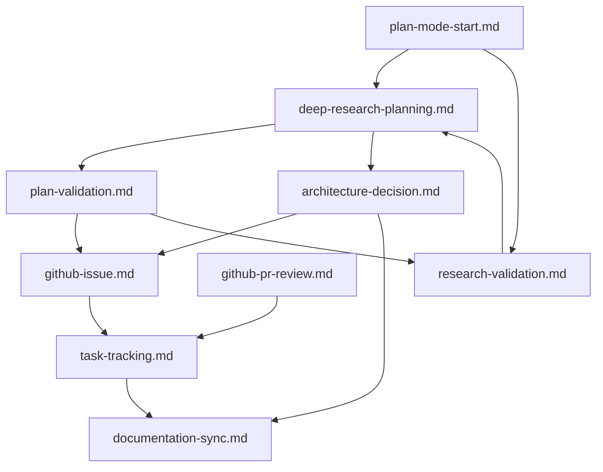

# Workflow Catalog

This file documents available workflows and their usage patterns. Workflows provide deterministic, step-by-step processes for common tasks.

## Available Workflows

### GitHub Operations

#### `.clinerules/workflows/github-issue.md` - Enhanced Issue Management
**Purpose**: Create and manage GitHub issues using centralized configuration
**Use When**: 
- Documenting feature requests or bugs
- Creating architectural proposals
- Tracking implementation tasks

**Key Features**:
- Uses MCP GitHub tools for consistency
- Centralized configuration from `.clinerules/repo-config.json`
- Interactive milestone selection from local list
- Template-based issue creation using GitHub templates
- Automatic project association (ID: 2)
- Issue type mapping (feat/fix/chore/rfc)

#### `.clinerules/workflows/github-pr-review.md` - Pull Request Review
**Purpose**: Comprehensive PR review process
**Use When**: 
- Reviewing code changes
- Providing structured feedback
- Approving or requesting changes

**Key Features**:
- Examines PR details and changed files
- Reviews context and surrounding code
- Structured user confirmation process
- Supports approval, change requests, and comments

#### `.clinerules/workflows/architecture-decision.md` - Enhanced ADR Creation
**Purpose**: Document architectural decisions with RFC subissue workflow
**Use When**: 
- Making major technical decisions
- Evaluating multiple implementation options
- Recording design rationale for future reference

**Key Features**:
- RFC-style issue creation using centralized config
- Structured decision documentation with milestone assignment
- RFC subissue workflow for implementation breakdown
- Automatic linking of subissues to parent RFC
- Integration with historical decisions
- Project association and tracking

#### `.clinerules/workflows/task-tracking.md` - Enhanced Issue Integration
**Purpose**: Link GitHub issues with project documentation using centralized configuration
**Use When**: 
- Starting new work streams
- Updating project status
- Tracking progress across multiple issues
- Managing RFC subissue workflows

**Key Features**:
- Configuration-based issue tracking
- Milestone-based organization
- RFC subissue tracking and management
- Cross-reference management with proper formatting
- Issue lifecycle management with status updates
- Integration with commit message generation

### Project Management

#### `.clinerules/workflows/milestone-management.md` - Milestone Synchronization
**Purpose**: Maintain milestone synchronization between GitHub and local configuration
**Use When**: 
- Milestone information seems outdated
- Before major issue creation campaigns
- Setting up new project phases

**Key Features**:
- Syncs GitHub milestones with local configuration
- Interactive milestone selection for issues
- Maintains milestone IDs consistently
- Updates local configuration when needed

#### `.clinerules/workflows/commit-message.md` - Commit Message Generation
**Purpose**: Generate standardized commit messages with GitHub issue association
**Use When**: 
- Committing changes for tracked issues
- Ensuring consistent commit message format
- Linking commits to GitHub issues

**Key Features**:
- Analyzes staged changes for scope detection
- Maps issue types to conventional commit types
- Generates proper commit format with issue references
- Supports breaking changes and multi-scope commits
- Optional commit execution

#### `.clinerules/workflows/project-context.md` - Project-Specific Guidance
**Purpose**: Provide project-specific command guidance and context
**Use When**: 
- Working in different workspace contexts
- Installing packages in mobile environment
- Running development or deployment commands
- Uncertain about project-specific patterns

**Key Features**:
- Yarn workspace command guidance
- Expo-specific mobile development patterns
- Context-aware command suggestions
- Development environment setup guidance
- Build and deployment procedures

### Process Management

#### `.clinerules/workflows/plan-mode-start.md` - Mandatory Planning Initiation
**Purpose**: Ensure consistent architecture planning and proper assessment for substantial tasks
**Use When**: 
- **MANDATORY**: Start of any substantial task in Plan Mode
- Before architectural decisions
- When evaluating implementation approaches
- Beginning feature development planning

**Key Features**:
- Enforces essential documentation review in prescribed order
- Applies Planning Mode Assessment Framework consistently
- Creates GitHub issues for tracking
- Integrates with research validation workflow
- Non-optional structured planning process

#### `.clinerules/workflows/task-completion.md` - Mandatory Documentation Updates
**Purpose**: Systematic documentation updates after human confirmation of completed work
**Use When**: 
- **MANDATORY**: After human confirms "this is done and working"
- Following successful implementation of features
- After architectural changes are completed and tested
- When major decisions have been implemented

**Key Features**:
- Updates currentTask.md with completed work
- Updates historicalDecisionsAndCaveats.md for major decisions
- Updates codebaseSummary.md for structural changes
- Cross-references GitHub issues with completion status
- Triggers documentation-sync when needed
- Non-optional systematic knowledge capture

#### `.clinerules/workflows/research-validation.md` - External Research and Validation
**Purpose**: Extended research using Perplexity to validate architectural approaches and gather external insights
**Use When**: 
- Evaluating complex architectural decisions
- Comparing implementation approaches or frameworks
- Investigating industry standards for specific patterns
- When internal knowledge needs external validation
- Technology evaluation and best practices research

**Key Features**:
- Structured research question templates
- Perplexity MCP tool integration for targeted research
- Research result analysis framework
- Integration with Planning Mode Assessment Framework
- Research summary templates for documentation
- Example scenarios for common use cases

#### `.clinerules/workflows/deep-research-planning.md` - Comprehensive Research & Planning
**Purpose**: Combines codebase analysis, external research, and sequential thinking to create precise implementation plans
**Use When**: 
- Complex implementation tasks requiring integration with existing codebase
- Architecture integration when new components must align with existing patterns
- Technology selection with codebase constraints
- Refactoring plans requiring understanding of current patterns

**Key Features**:
- Systematic codebase analysis with precise file and function identification
- External research using Perplexity for industry best practices
- Sequential thinking synthesis for comprehensive implementation plans
- Structured output with exact file paths, code changes, and validation steps
- Integration point verification and risk assessment
- Precise deliverables with measurable outcomes

#### `.clinerules/workflows/plan-validation.md` - Systematic Plan Validation
**Purpose**: Critical analysis of implementation plans using sequential thinking to identify gaps and verify feasibility
**Use When**: 
- Before implementing plans created by deep-research-planning or other processes
- Plan review when existing plans need critical evaluation
- Risk assessment for implementation plans
- Architecture validation for significant decisions

**Key Features**:
- Systematic validation using sequential thinking analysis
- File existence and integration point verification
- Technical feasibility, architecture alignment, and completeness assessment
- Structured validation reports with PASS/FAIL/NEEDS_REVISION decisions
- Priority-ordered action items with specific remediation steps
- Evidence-based assessment with exact file/line references

### Documentation Management

#### `.clinerules/workflows/documentation-sync.md` - Documentation Updates
**Purpose**: Maintain consistent and current documentation
**Use When**: 
- Completing major tasks
- Architectural changes occur
- Cross-references need validation

**Key Features**:
- Reviews all cline_docs files
- Validates cross-references and links
- Creates documentation PRs when needed
- Ensures consistency across files

## Workflow Invocation

### Basic Usage
```
.clinerules/workflows/workflow-name.md
```

### Parameters
Some workflows may prompt for parameters such as:
- Issue numbers for PR reviews
- Search terms for issue creation
- File paths for documentation updates

### Mode Awareness
Workflows are designed to work in both Plan and Act modes:
- **Plan Mode**: Focus on investigation and proposal
- **Act Mode**: Execute changes and updates

## Integration Guidelines

### Cross-Workflow Dependencies



### Workflow Chains
Common workflow sequences:

1. **Feature Development**:
   - `.clinerules/workflows/github-issue.md` → `.clinerules/workflows/task-tracking.md` → `.clinerules/workflows/documentation-sync.md`

2. **Architecture Planning**:
   - `.clinerules/workflows/architecture-decision.md` → `.clinerules/workflows/github-issue.md` → `.clinerules/workflows/task-tracking.md`

3. **Code Review**:
   - `.clinerules/workflows/github-pr-review.md` → `.clinerules/workflows/task-tracking.md` → `.clinerules/workflows/documentation-sync.md`

4. **Deep Research & Implementation Planning**:
   - `.clinerules/workflows/plan-mode-start.md` → `.clinerules/workflows/deep-research-planning.md` → `.clinerules/workflows/plan-validation.md` → `.clinerules/workflows/github-issue.md`

5. **Plan Validation & Improvement**:
   - `.clinerules/workflows/plan-validation.md` → `.clinerules/workflows/research-validation.md` → `.clinerules/workflows/deep-research-planning.md` (for plan revision)

6. **Complex Feature Development (Full Chain)**:
   - `.clinerules/workflows/plan-mode-start.md` → `.clinerules/workflows/deep-research-planning.md` → `.clinerules/workflows/plan-validation.md` → `.clinerules/workflows/github-issue.md` → `.clinerules/workflows/task-tracking.md` → `.clinerules/workflows/documentation-sync.md`

## Best Practices

### When to Use Workflows
- **Deterministic Tasks**: Use workflows for tasks that follow predictable patterns
- **Documentation Requirements**: When changes need to be tracked or documented
- **Cross-System Integration**: When multiple systems (GitHub, cline_docs) need coordination
- **Quality Assurance**: When consistency and completeness are critical

### When NOT to Use Workflows
- **Simple Tasks**: Basic file reading or single-step operations
- **Exploratory Work**: When the process is uncertain or experimental
- **One-Off Operations**: Tasks unlikely to be repeated

### Workflow Maintenance
- Review workflow effectiveness regularly
- Update workflows based on changing needs
- Add new workflows for recurring patterns
- Remove or deprecate workflows that are no longer useful

## Repository Context

All workflows are configured for:
- **Repository**: `arri-cc/today-is-my-bday`
- **GitHub Integration**: Uses MCP GitHub tools
- **Documentation**: Integrates with `cline_docs/` structure
- **Cross-References**: Maintains links between systems

## Implementation Guidelines

### Creating New Workflows
1. Identify a recurring pattern that would benefit from standardization
2. Document the step-by-step process with MCP tool calls
3. Include error handling and validation steps
4. Test the workflow in both Plan and Act modes
5. Update this catalog with the new workflow

### Workflow Structure Template
```markdown
# [Workflow Name]

## Purpose
[Brief description of what this workflow accomplishes]

## Step 1: [Action Name]
[MCP tool calls or other actions]

## Step 2: [Action Name]
[Subsequent steps]

## Guidelines
[Usage guidelines and best practices]
```

This workflow-based approach ensures consistent, deterministic execution of common project management and development tasks while maintaining flexibility for unique situations.
