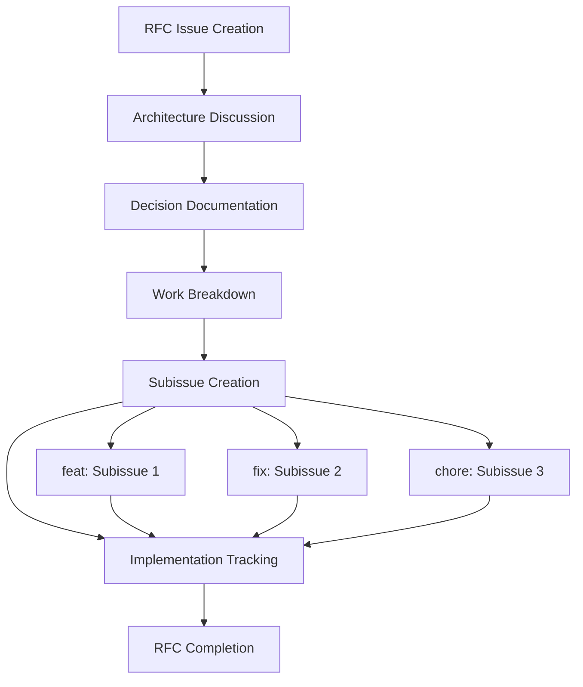

# Architecture Decision Record Workflow

Enhanced workflow using centralized configuration for consistent ADR creation and RFC subissue management.

## Step 1: Load Configuration

```xml
<read_file>
<path>.clinerules/repo-config.json</path>
</read_file>
```

## Step 2: Create RFC Issue for Discussion

Create an RFC (Request for Comments) issue using centralized configuration:

```xml
<use_mcp_tool>
<server_name>github.com/modelcontextprotocol/servers/tree/main/src/github</server_name>
<tool_name>create_issue</tool_name>
<arguments>
{
  "owner": "{config.repository.owner}",
  "repo": "{config.repository.repo}",
  "title": "{config.issueTypes.rfc.titlePrefix}[Architecture Decision Title]",
  "body": "## Summary\n\nA description of the problem to solve\n\n## Available Options\n\nProvide details on options under consideration\n\n## Proposed Solution\n\nA detailed description, with diagrams, of your the proposed solution.\n\n### Work Breakdown\n\nSuggested breakdown of the work\n\n### Risks and Complexities\n\nProvide details about any known risks or challenges that might negatively impact the scope of this work\n\n### Additional Info\n\nAny miscellaneous info that's valueable",
  "labels": "{config.issueTypes.rfc.labels}",
  "milestone": "{selected milestone id from config}"
}
</arguments>
</use_mcp_tool>
```

## Step 3: Milestone Selection

Present available milestones from configuration:

1. **Phase 1: Core Architecture** - Foundation and core functionality
2. **Phase 2: Enhanced Features** - Advanced functionality and UX improvements
3. **Phase 3: Production Ready** - Performance, security, and deployment

Ask user to select appropriate milestone for the RFC.

## Step 4: Architectural Discussion

Use the RFC issue for:
- Gathering input from stakeholders
- Discussing alternatives and tradeoffs
- Documenting constraints and requirements
- Building consensus on the approach

## Step 5: Decision Documentation

Once consensus is reached, document the final decision in the RFC issue with:
- Chosen solution and rationale
- Implementation approach
- Migration strategy (if applicable)
- Success criteria

## Step 6: Work Breakdown and Subissue Creation

For RFC issues with implementation work, create subissues for each work item:

### Identify Work Items
Break down the RFC implementation into specific tasks:
- New features → `feat` type issues
- Bug fixes → `fix` type issues  
- Maintenance work → `chore` type issues

### Create Subissues
For each work item, create a subissue using the appropriate type:

```xml
<use_mcp_tool>
<server_name>github.com/modelcontextprotocol/servers/tree/main/src/github</server_name>
<tool_name>create_issue</tool_name>
<arguments>
{
  "owner": "{config.repository.owner}",
  "repo": "{config.repository.repo}",
  "title": "{config.issueTypes[workItemType].titlePrefix}[Work Item Title]",
  "body": "## Summary\n\nImplementation task for RFC #{rfc_issue_number}\n\n## Context\n\nThis issue implements part of the architectural decision documented in #{rfc_issue_number}\n\n## Acceptance Criteria\n\n- [ ] [Specific criteria for this work item]\n\n## Parent RFC\n\nCloses part of #{rfc_issue_number}",
  "labels": "{config.issueTypes[workItemType].labels}",
  "milestone": "{same milestone as parent RFC}"
}
</arguments>
</use_mcp_tool>
```

### Link Subissues to Parent RFC
Update the RFC issue to reference all created subissues:

```xml
<use_mcp_tool>
<server_name>github.com/modelcontextprotocol/servers/tree/main/src/github</server_name>
<tool_name>add_issue_comment</tool_name>
<arguments>
{
  "owner": "{config.repository.owner}",
  "repo": "{config.repository.repo}",
  "issue_number": "{rfc_issue_number}",
  "body": "## Implementation Issues\n\nThe following issues have been created to implement this RFC:\n\n- [ ] #{subissue1_number} - [Subissue 1 Title]\n- [ ] #{subissue2_number} - [Subissue 2 Title]\n- [ ] #{subissue3_number} - [Subissue 3 Title]"
}
</arguments>
</use_mcp_tool>
```

## Step 7: Update Documentation

### Update cline_docs/currentTask.md
Add reference to the new RFC and track its subissues:

```markdown
## Related GitHub Issues

### In Progress
1. [#{rfc_number} - rfc: {RFC Title}](https://github.com/{owner}/{repo}/issues/{rfc_number})
   **Status**: RFC Discussion Phase
   **Context**: {Brief context of architectural decision}
   **Subissues**: #{sub1}, #{sub2}, #{sub3}
```

### Update cline_docs/historicalDecisionsAndCaveats.md (when completed)
For major architectural decisions, add to the historical record after implementation:

```markdown
## Architecture

### {Decision Title}
- **Decision**: {Brief summary of what was decided}
- **Rationale**: {Key reasons for the decision}
- **Impact**: {How this affects the system}
- **Date**: {When decided}
- **RFC Issue**: [#{issue_number}](https://github.com/{owner}/{repo}/issues/{issue_number})
- **Implementation Issues**: #{sub1}, #{sub2}, #{sub3}
```

## Step 8: Project Association

Associate the RFC and all subissues with the GitHub project:

```xml
<use_mcp_tool>
<server_name>github.com/modelcontextprotocol/servers/tree/main/src/github</server_name>
<tool_name>update_issue</tool_name>
<arguments>
{
  "owner": "{config.repository.owner}",
  "repo": "{config.repository.repo}",
  "issue_number": "{issue_number}",
  "body": "{updated body with project reference if needed}"
}
</arguments>
</use_mcp_tool>
```

## RFC Subissue Workflow Pattern



## Configuration Integration

This workflow leverages `.clinerules/repo-config.json` for:

- **Repository Settings**: Owner, repo, project ID
- **Issue Type Configuration**: RFC labels, title prefixes, commit types  
- **Milestone Management**: Available milestones for assignment
- **Subissue Type Mapping**: Proper labels and templates for work items

## Guidelines

### When to Create an RFC:

- Major technology stack changes
- Architectural pattern decisions
- Database schema changes
- API design decisions
- Security architecture choices
- Integration pattern selections
- Performance optimization strategies

### RFC Review Process:

1. Create RFC issue with detailed analysis
2. Allow time for team review and feedback (typically 3-7 days)
3. Address feedback and update the proposal
4. Make final decision and update issue status
5. Create implementation subissues
6. Track progress through subissue completion
7. Update documentation when RFC is fully implemented

### Subissue Best Practices:

- Each subissue should be independently implementable
- Link subissues to parent RFC for traceability
- Use appropriate issue types (feat/fix/chore) for subissues
- Assign same milestone as parent RFC
- Close subissues as work is completed
- Close RFC when all subissues are completed
