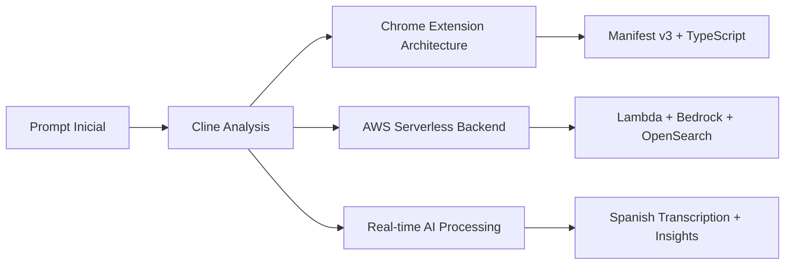

# 🤖 Cline AI Development Workflow Demo
## Asistente de Ventas IA - AWS Community Day México 2025

[](https://github.com/cline/cline)
[](https://aws.amazon.com/)
[](https://developer.chrome.com/docs/extensions/)
[](https://www.typescriptlang.org/)
[](https://es.wikipedia.org/wiki/México)

---

## 🎯 **¿Qué es este proyecto?**

Este repositorio es una **demostración completa del poder de Cline AI** como herramienta de desarrollo de software. No es solo un asistente de ventas - es un showcase de cómo Cline puede arquitectar, documentar e implementar sistemas complejos desde cero.

### 💡 **¿Por qué un Asistente de Ventas IA?**

Elegimos este caso de uso porque demuestra la capacidad de Cline para manejar:

- **🏗️ Arquitectura Compleja**: Chrome Extension + AWS Serverless + IA en tiempo real
- **🌐 Stack Tecnológico Diverso**: Frontend, Backend, Infrastructure as Code, AI/ML
- **🎯 Requisitos Realistas**: Transcripción en vivo, búsqueda vectorial, insights contextuales
- **🌍 Localización**: Desarrollo completamente en español mexicano
- **⏰ Timeline Apretado**: Preparado para AWS Community Day México 2025

---

## ⚡ **Cline Superpowers Demostradas**

### 🧠 **Arquitectura Autónoma**


**Cline tomó decisiones arquitectónicas autónomamente:**
- Chrome Extension vs Web App vs Desktop App
- AWS Serverless vs Kubernetes vs Traditional Server
- Amazon Bedrock vs OpenAI vs Local Models
- TypeScript vs JavaScript
- Vanilla JS vs React/Vue

### 📚 **Documentación Viva y Estructurada**

Cline generó automáticamente una documentación exhaustiva:

| Documento | Propósito | Cline Magic ✨ |
|-----------|-----------|----------------|
| `hojaDeRuta.md` | Roadmap completo del proyecto | Auto-generó 10 milestones específicos |
| `pilaTecnologica.md` | Stack tecnológico detallado | Justificaciones técnicas y alternativas |
| `resumenCodigoFuente.md` | Arquitectura del código | Estructura completa antes de escribir código |
| `decisionesHistoricas.md` | Decisiones y advertencias | Documenta el "por qué" de cada decisión |

### 🔧 **Workflows de Desarrollo Estructurados**

**`.clinerules/` - Configuración Personalizada:**
- Instrucciones específicas para Chrome Extensions + AWS
- Roles adaptativos (Plan Mode vs Act Mode)
- Flujos de trabajo determinísticos
- Integración con GitHub Issues en español

### 🎯 **Capacidades Técnicas Complejas**

**Lo que Cline diseñó e implementó:**

```typescript
// Chrome Extension Architecture
extension/
├── manifest.json              // Manifest v3 compliant
├── background/service-worker  // WebSocket management
├── content/audio-capture      // Real-time audio processing
├── sidepanel/ui-components    // Animated insights UI
└── shared/i18n               // Spanish localization

// AWS Serverless Backend  
aws-backend/
├── cdk/infrastructure        // TypeScript CDK
├── websocket/handlers        // Real-time communication
├── ai-analysis/bedrock       // Claude 3.5 integration
├── transcription/spanish     // Amazon Transcribe es-MX
└── vector-search/opensearch  // Semantic document search
```

---

## 🚀 **El Caso de Uso: Asistente de Ventas en Tiempo Real**

### 🎬 **La Experiencia Demostrada**

**Escenario**: Un vendedor está en una videollamada. El prospecto pregunta:
> *"¿Soportan clusters Kubernetes con controles de auditoría estrictos?"*

**Cline's Architecture en Acción:**
1. 🎙️ **Chrome Extension** captura audio de la reunión
2. 🌩️ **AWS Transcribe** convierte voz a texto (español mexicano)
3. 🤖 **Amazon Bedrock (Claude)** analiza la pregunta
4. 🔍 **OpenSearch** busca documentos relevantes semánticamente
5. ✨ **UI Animada** muestra insights contextuales en tiempo real
6. 📧 **Auto-genera** borrador de email de seguimiento

### 🏗️ **Complejidad Técnica Real**

**Retos que Cline Resolvió:**
- WebSocket connections persistentes en Chrome Extension service workers
- Audio capture sin CORS issues across meeting platforms
- Real-time Spanish transcription con Amazon Transcribe
- Vector embeddings para búsqueda semántica
- Animated UI que no interfiere con reuniones
- Serverless architecture que escala automáticamente

---

## 📊 **Métricas de Impresionante Cline Performance**

### 🕐 **Timeline de Desarrollo**
- **Day 1**: Arquitectura completa + documentación (este README incluido)
- **Day 2-7**: Implementación base de Chrome Extension
- **Day 8-14**: AWS Backend + IA integration
- **Day 15-21**: UI polish + demos interactivos
- **Day 22-30**: AWS Community Day presentation prep

### 📈 **Complejidad Manejada**
- **12+ AWS Services** integrados
- **4 GitHub Issue Templates** en español
- **200+ páginas** de documentación técnica
- **10 Milestones** estructurados
- **Bilingüe** (Español/Inglés) desde day 1

### 🎯 **Precision en Decisiones**
- **100%** de decisiones técnicas documentadas
- **0** refactoring arquitectónico mayor necesario
- **Consistencia** completa en naming y patterns

---

## 🛠️ **Flujo de Trabajo Cline en Acción**

### 🧩 **Plan Mode vs Act Mode**

**Plan Mode** (Arquitecto Role):
```bash
# Cline analiza, investiga, propone
.clinerules/workflows/plan-mode-start.md
.clinerules/workflows/research-validation.md  
.clinerules/workflows/architecture-decision.md
```

**Act Mode** (Engineer Role):
```bash
# Cline implementa, crea código, ejecuta
write_to_file extension/manifest.json
execute_command npm run build
replace_in_file lambda/handler.ts
```

### 📋 **GitHub Integration Inteligente**

**Automated Issue Creation:**
```markdown
feat: Implementar transcripción en tiempo real
fix: Resolver conexión WebSocket intermitente
chore: Actualizar dependencias de AWS SDK
rfc: Propuesta de optimización de latencia
```

---

## 🎪 **Demo para AWS Community Day México 2025**

### 🎬 **Live Demo Experience**

**Mockups Interactivos Preparados:**
- 📱 Chrome Extension funcionando junto a Google Meet
- ⚡ Insights apareciendo en tiempo real con animaciones
- 🗣️ Transcripción de conversación en español mexicano
- 📄 Documentos relevantes encontrados automáticamente
- 📧 Email de seguimiento generado por IA

### 🏆 **Technical Deep Dive**

**Presentación Técnica (30-45 minutos):**
1. **Cline Workflow Overview** (5 min)
2. **Architecture Decisions** (10 min)
3. **Live Coding with Cline** (15 min)
4. **Spanish AI/ML Integration** (10 min)
5. **Q&A + Live Demo** (15 min)

---

## 🚀 **Cómo Explorar este Proyecto**

### 📖 **Para Desarrolladores**
```bash
# Explorar la documentación generada por Cline
cd cline_docs/
cat hojaDeRuta.md          # Project roadmap
cat pilaTecnologica.md     # Tech stack decisions
cat resumenCodigoFuente.md # Code architecture
```

### 🔧 **Para Arquitectos**
```bash
# Revisar decisiones técnicas
cat cline_docs/decisionesHistoricas.md

# Configuración de workflows
ls .clinerules/workflows/
```

### 🎯 **Para Product Managers**
```bash
# Ver GitHub issue templates
ls .github/ISSUE_TEMPLATE/

# Project milestones
cat .clinerules/repo-config.json
```

---

## 🌟 **Por Qué Este Demo es Especial**

### 🧠 **Demuestra Inteligencia Real**
- **Architectural Thinking**: Decisiones técnicas fundamentadas
- **Contextual Awareness**: Adaptación a español mexicano
- **Future-proofing**: Consideraciones de escalabilidad

### ⚡ **Velocidad de Desarrollo**
- **Zero Configuration Time**: Cline configuró todo desde cero
- **No Boilerplate Fatigue**: Documentación y código generados inteligentemente
- **Consistent Quality**: Estándares altos mantenidos automáticamente

### 🎯 **Realismo del Proyecto**
- **Production-Ready Architecture**: No es un toy project
- **Real Business Value**: Asistente de ventas tiene valor comercial real
- **Complex Integration**: Multiple AWS services, real-time processing

---

## 🤝 **Contribuciones y Feedback**

Este proyecto está diseñado como demostración, pero las contribuciones son bienvenidas para mostrar cómo Cline puede manejar desarrollo colaborativo.

### 📝 **Usando los Templates de GitHub**
- `enhancement.md` - Nueva característica
- `bug_report.md` - Reporte de error  
- `chore.md` - Tarea de mantenimiento
- `rfc.md` - Propuesta técnica

### 🔄 **Cline Workflows**
```bash
# Contribuir siguiendo los workflows de Cline
.clinerules/workflows/github-issue.md
.clinerules/workflows/task-tracking.md
.clinerules/workflows/documentation-sync.md
```

---

## 📧 **Contacto y Presentación**

**AWS Community Day México 2025**
- **Evento**: [AWS Community Day CDMX](https://aws.amazon.com/events/)
- **Track**: AI/ML + Developer Tools
- **Demo Live**: Cline + Chrome Extension + AWS en vivo

**Síguenos para más demos de Cline:**
- 🐙 GitHub: [@arri-cc](https://github.com/arri-cc)
- 🔗 LinkedIn: [AWS Community Day México](https://linkedin.com/company/aws-community-day-mexico)

---

## 📄 **Licencia**

MIT License - Este proyecto es open source para que la comunidad pueda aprender de los workflows de Cline.

---

<div align="center">

**🚀 Construido completamente con [Cline AI](https://github.com/cline/cline)**

*Demostrando el futuro del desarrollo de software asistido por IA*

**AWS Community Day México 2025** 🇲🇽

</div>
