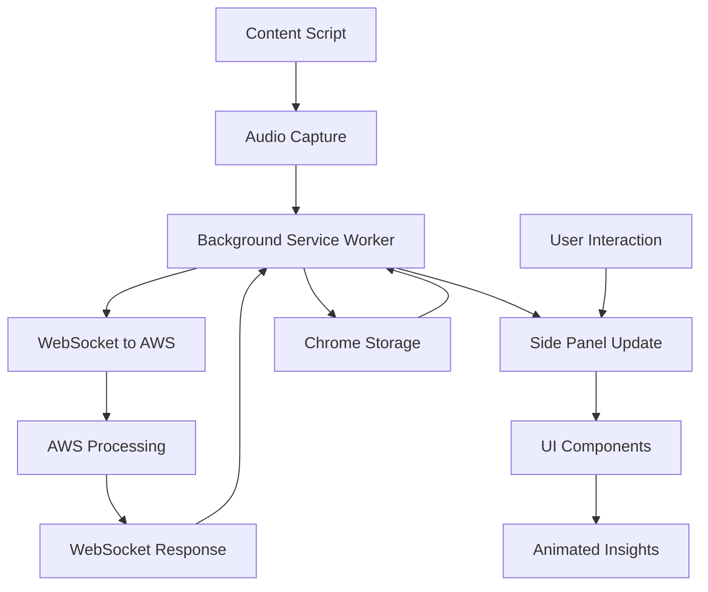
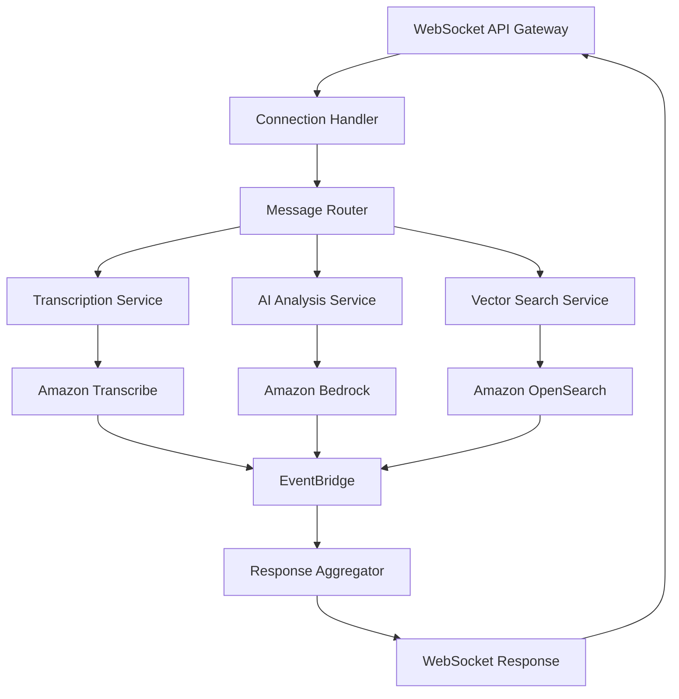

# Resumen del Código Fuente - Asistente de Ventas IA

## Estructura General del Proyecto

### 📁 Organización de Alto Nivel
```
aws-community-day-cdmx-2025/
├── .clinerules/                    # Configuración de desarrollo
├── cline_docs/                     # Documentación del proyecto
├── extension/                      # Chrome Extension source
├── aws-backend/                    # AWS serverless infrastructure
├── demos/                          # Prototipos y mockups interactivos
├── docs/                          # Documentación técnica adicional
└── scripts/                       # Scripts de build y despliegue
```

## Componentes Clave y Sus Interacciones

### 🎯 Chrome Extension (Frontend)

#### Arquitectura de Componentes
```
extension/
├── manifest.json                   # Configuración Manifest v3
├── src/
│   ├── background/                 # Service Worker (Persistente)
│   │   ├── service-worker.ts       # Entry point del background script
│   │   ├── aws-websocket.ts        # Gestión de conexiones WebSocket
│   │   ├── storage-manager.ts      # Manejo de chrome.storage
│   │   └── connection-health.ts    # Monitoreo de conectividad
│   │
│   ├── content/                    # Content Scripts (Inyectados)
│   │   ├── meeting-injector.ts     # Script principal inyectado
│   │   ├── audio-capture.ts        # Captura de MediaStream
│   │   ├── platform-detectors/     # Detectores por plataforma
│   │   │   ├── zoom-detector.ts    # Detección específica Zoom
│   │   │   ├── teams-detector.ts   # Detección específica Teams
│   │   │   ├── meet-detector.ts    # Detección específica Google Meet
│   │   │   └── generic-detector.ts # Detector genérico
│   │   └── ui-overlay.ts           # Overlay de insights en página
│   │
│   ├── sidepanel/                  # Panel Lateral Principal
│   │   ├── sidepanel.html          # HTML del panel lateral
│   │   ├── sidepanel.ts            # Controlador principal
│   │   ├── components/             # Web Components modulares
│   │   │   ├── base-component.ts   # Clase base para componentes
│   │   │   ├── transcription-feed.ts # Feed de transcripción en vivo
│   │   │   ├── insight-cards.ts    # Tarjetas de insights animadas
│   │   │   ├── search-panel.ts     # Panel de búsqueda vectorial
│   │   │   ├── meeting-controls.ts # Controles de reunión
│   │   │   └── email-draft.ts      # Generador de emails
│   │   ├── services/               # Servicios del panel
│   │   │   ├── websocket-client.ts # Cliente WebSocket
│   │   │   ├── state-manager.ts    # Gestión de estado local
│   │   │   └── animation-engine.ts # Motor de animaciones
│   │   └── styles/                 # CSS modular
│   │       ├── main.css            # Estilos principales
│   │       ├── components.css      # Estilos de componentes
│   │       ├── animations.css      # Animaciones CSS
│   │       └── themes.css          # Variables de theming
│   │
│   ├── popup/                      # Popup de Configuración
│   │   ├── popup.html              # Interfaz de configuración
│   │   ├── popup.ts                # Lógica de configuración
│   │   └── config-manager.ts       # Gestión de configuración
│   │
│   └── shared/                     # Utilidades Compartidas
│       ├── types.ts                # Tipos TypeScript compartidos
│       ├── constants.ts            # Constantes globales
│       ├── utils.ts                # Utilidades generales
│       └── i18n.ts                 # Internacionalización
│
├── assets/                         # Recursos Estáticos
│   ├── icons/                      # Iconos de la extensión
│   ├── images/                     # Imágenes y gráficos
│   └── sounds/                     # Sonidos de notificación
│
└── build/                          # Configuración de Build
    ├── webpack.config.js           # Configuración Webpack
    ├── tsconfig.json               # Configuración TypeScript
    └── package.json                # Dependencias del frontend
```

#### Flujo de Datos Frontend


### ☁️ AWS Backend (Serverless)

#### Arquitectura de Servicios
```
aws-backend/
├── cdk/                            # Infrastructure as Code
│   ├── bin/                        # CDK entry points
│   │   └── app.ts                  # CDK app definition
│   ├── lib/                        # Stack definitions
│   │   ├── networking-stack.ts     # VPC, subnets, security groups
│   │   ├── api-gateway-stack.ts    # WebSocket API Gateway
│   │   ├── lambda-stack.ts         # Lambda functions
│   │   ├── ai-services-stack.ts    # Bedrock, Transcribe setup
│   │   ├── search-stack.ts         # OpenSearch configuration
│   │   ├── storage-stack.ts        # S3 buckets, DynamoDB
│   │   └── monitoring-stack.ts     # CloudWatch, alarms
│   └── cdk.json                    # CDK configuration
│
├── src/                            # Lambda source code
│   ├── websocket/                  # WebSocket API handlers
│   │   ├── connect-handler.ts      # Connection establishment
│   │   ├── disconnect-handler.ts   # Connection cleanup
│   │   ├── message-router.ts       # Message routing logic
│   │   └── connection-store.ts     # DynamoDB connection storage
│   │
│   ├── transcription/              # Speech processing
│   │   ├── transcribe-handler.ts   # Amazon Transcribe integration
│   │   ├── audio-processor.ts      # Audio format conversion
│   │   ├── language-detector.ts    # Language detection
│   │   └── real-time-stream.ts     # Streaming transcription
│   │
│   ├── ai-analysis/                # AI processing pipeline
│   │   ├── bedrock-client.ts       # Amazon Bedrock wrapper
│   │   ├── conversation-analyzer.ts # Conversation analysis
│   │   ├── insight-extractor.ts    # Insight extraction
│   │   ├── email-generator.ts      # Email draft generation
│   │   └── prompts/                # Prompt templates
│   │       ├── sales-analysis.ts   # Sales conversation prompts
│   │       ├── insight-generation.ts # Insight prompts
│   │       └── email-templates.ts  # Email generation prompts
│   │
│   ├── vector-search/              # Semantic search system
│   │   ├── opensearch-client.ts    # OpenSearch wrapper
│   │   ├── embedding-service.ts    # Text embedding generation
│   │   ├── document-indexer.ts     # Document indexing pipeline
│   │   ├── search-engine.ts        # Semantic search logic
│   │   └── relevance-scorer.ts     # Search result scoring
│   │
│   ├── document-processing/        # Knowledge base management
│   │   ├── s3-processor.ts         # S3 document processing
│   │   ├── pdf-extractor.ts        # PDF text extraction
│   │   ├── docx-extractor.ts       # Word document extraction
│   │   ├── chunking-service.ts     # Document chunking
│   │   └── metadata-extractor.ts   # Document metadata
│   │
│   └── shared/                     # Shared utilities
│       ├── types.ts                # Shared TypeScript types
│       ├── config.ts               # Configuration management
│       ├── logger.ts               # Structured logging
│       ├── error-handler.ts        # Error handling utilities
│       └── metrics.ts              # CloudWatch metrics
│
├── tests/                          # Test suites
│   ├── unit/                       # Unit tests
│   ├── integration/                # Integration tests
│   └── e2e/                        # End-to-end tests
│
└── docs/                           # AWS documentation
    ├── architecture.md             # Architecture decisions
    ├── deployment.md               # Deployment guide
    └── api-reference.md            # API documentation
```

#### Flujo de Datos Backend


## Flujo de Datos Completo

### 🔄 Procesamiento End-to-End

#### 1. Captura de Audio (Extension)
```typescript
// Flujo de captura en content script
navigator.mediaDevices.getUserMedia({ audio: true })
  .then(stream => {
    // Procesamiento local de audio
    const audioContext = new AudioContext();
    const mediaRecorder = new MediaRecorder(stream);
    
    // Envío a background service worker
    chrome.runtime.sendMessage({
      type: 'AUDIO_CHUNK',
      data: audioBuffer
    });
  });
```

#### 2. Procesamiento en Background (Extension)
```typescript
// Service worker procesa y envía a AWS
chrome.runtime.onMessage.addListener((message) => {
  if (message.type === 'AUDIO_CHUNK') {
    // Envío vía WebSocket a AWS
    websocket.send(JSON.stringify({
      action: 'processAudio',
      audioData: message.data,
      sessionId: currentSessionId
    }));
  }
});
```

#### 3. Procesamiento AWS (Backend)
```typescript
// Lambda WebSocket handler
export const handler = async (event) => {
  const { action, audioData, sessionId } = JSON.parse(event.body);
  
  switch (action) {
    case 'processAudio':
      // Pipeline paralelo
      await Promise.all([
        transcribeAudio(audioData, sessionId),
        analyzeConversation(sessionId),
        searchRelevantDocs(lastTranscription)
      ]);
      break;
  }
};
```

#### 4. Respuesta y UI Update (Extension)
```typescript
// Side panel recibe insights
websocket.onmessage = (event) => {
  const response = JSON.parse(event.data);
  
  switch (response.type) {
    case 'TRANSCRIPTION':
      updateTranscriptionFeed(response.text);
      break;
    case 'INSIGHT':
      showAnimatedInsight(response.insight);
      break;
    case 'SEARCH_RESULTS':
      updateSearchPanel(response.documents);
      break;
  }
};
```

## Dependencias Externas

### 📦 Frontend Dependencies
```json
{
  "dependencies": {
    "@types/chrome": "^0.0.268",
    "aws-sdk": "^2.1691.0",
    "typescript": "^5.3.0"
  },
  "devDependencies": {
    "webpack": "^5.89.0",
    "@typescript-eslint/eslint-plugin": "^6.13.0",
    "web-ext": "^7.8.0"
  }
}
```

### ☁️ Backend Dependencies
```json
{
  "dependencies": {
    "aws-cdk-lib": "^2.109.0",
    "@aws-sdk/client-bedrock-runtime": "^3.456.0",
    "@aws-sdk/client-transcribe": "^3.456.0",
    "@opensearch-project/opensearch": "^2.4.0"
  }
}
```

## Cambios Significativos Recientes

### ✅ Configuración Inicial (Actual)
- Establecida estructura completa de documentación
- Definida arquitectura Chrome Extension + AWS serverless
- Configurados .clinerules específicos para el proyecto
- Creada configuración de repositorio centralizada

### 🔄 Próximos Cambios Planificados
- Implementación de estructura de directorios actual
- Configuración de Manifest v3 funcional
- Setup inicial de infraestructura AWS con CDK
- Prototipos de UI con animaciones CSS

## Integración de Retroalimentación del Usuario

### 📊 Métricas de Usuario Planificadas
```typescript
// Métricas que se capturarán
interface UserMetrics {
  sessionDuration: number;
  insightsGenerated: number;
  searchQueriesPerformed: number;
  emailDraftsCreated: number;
  userSatisfactionRating: number;
}
```

### 🔄 Feedback Loop
1. **Captura**: Métricas automáticas + feedback explícito
2. **Análisis**: CloudWatch Insights + dashboard personalizado
3. **Iteración**: Mejoras basadas en patrones de uso
4. **Validación**: A/B testing de nuevas características

## Consideraciones de Arquitectura

### 🔒 Seguridad
- Content Security Policy estricto en extension
- Validación de input en todos los puntos de entrada
- Encriptación end-to-end para datos sensibles
- Rate limiting en APIs para prevenir abuso

### ⚡ Performance
- Lazy loading de componentes no críticos
- Caching inteligente en chrome.storage
- Compression de payloads WebSocket
- Optimización de consultas OpenSearch

### 🌐 Escalabilidad
- Arquitectura event-driven para desacoplamiento
- Auto-scaling de Lambda functions
- Multi-región deployment capability
- Horizontal scaling de OpenSearch cluster

---

*Última actualización: 14 de junio, 2025*
*Versión de arquitectura: v1.0.0*
*Próxima revisión: Después de implementar estructura inicial*
